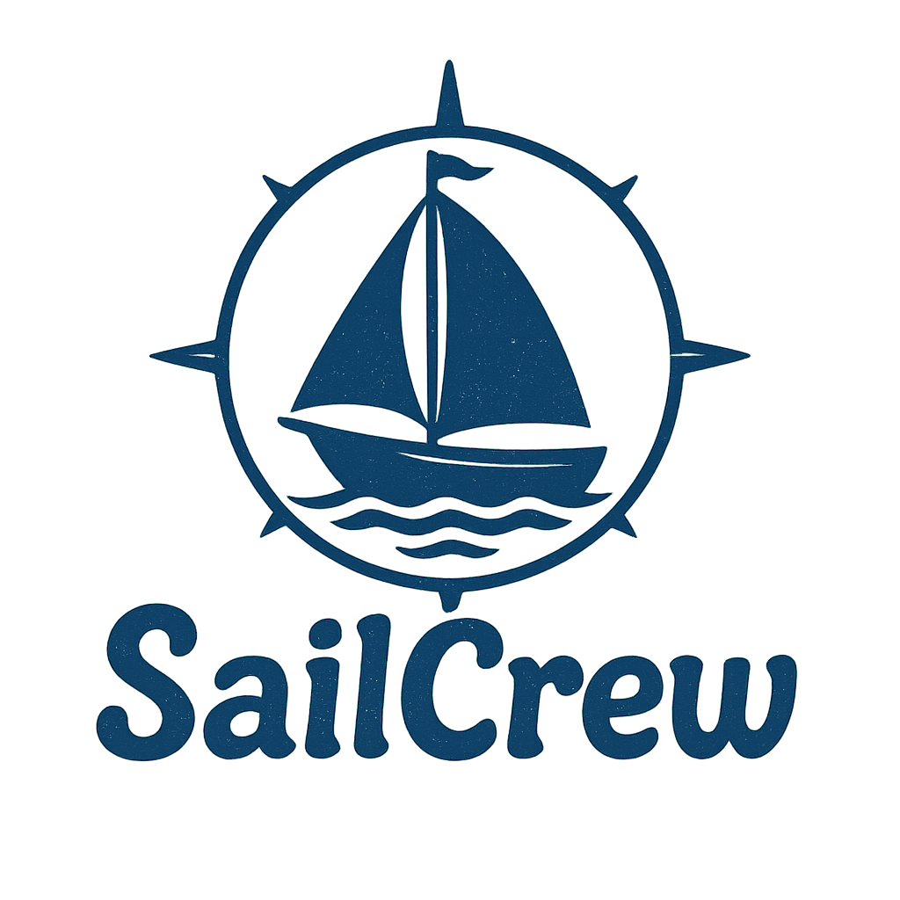

# ⛵ SailCrew

Free and Open-Source Sailing Planner. Built with [Nuxt](https://nuxt.com).

SailCrew is a no-fuss, free, and open-source sailing trip planner designed for privacy-conscious sailors who want simplicity and control.

As a proud sailboat owner, I often plan trips with family and friends. I couldn’t find a tool that was:
- Completely free
- Required no sign-up
- Privacy-respecting (no central server)
- Easy to use

...and that also allowed my crew to contribute by uploading geolocated photos and viewing our trip route — all while offline or on our own terms.

So I built SailCrew.

**Note: SailCrew is still in development so there are bugs and missing features. The basic features are there if you'd like to play with it.**

## ✨ Features
- 🗺️ Plan sailing trips without registration or tracking
- 📸 Save geolocated photos along the trip route
- 👥 Allow your crew to view and upload pictures collaboratively
- 🔐 100% local-first — your data stays with you
- 🌐 Optional self-hostable backend (WebDAV-based)

## 💾 SailSync (Optional)

Want to sync your data across devices or with your crew? You can self-host the companion backend: SailSync, a lightweight WebDAV server tailored for SailCrew. This keeps everything private and under your control.

## Special Credits

- [Nuxt](https://nuxt.com)
- [Leaflet](https://leafletjs.com)
- [OpenSeaMap](https://openseamap.org)
- [OpenMapTiles](https://openmaptiles.org/)
- [EMODnet](https://emodnet.ec.europa.eu)

## Setup

Make sure to install dependencies:

```bash
# npm
npm install

# pnpm
pnpm install

# yarn
yarn install

# bun
bun install
```

## Development Server

Start the development server on `http://localhost:3000`:

```bash
# npm
npm run dev

# pnpm
pnpm dev

# yarn
yarn dev

# bun
bun run dev
```

## Production

Build the application for production:

```bash
# npm
npm run build

# pnpm
pnpm build

# yarn
yarn build

# bun
bun run build
```

Locally preview production build:

```bash
# npm
npm run preview

# pnpm
pnpm preview

# yarn
yarn preview

# bun
bun run preview
```

Check out the [deployment documentation](https://nuxt.com/docs/getting-started/deployment) for more information.
